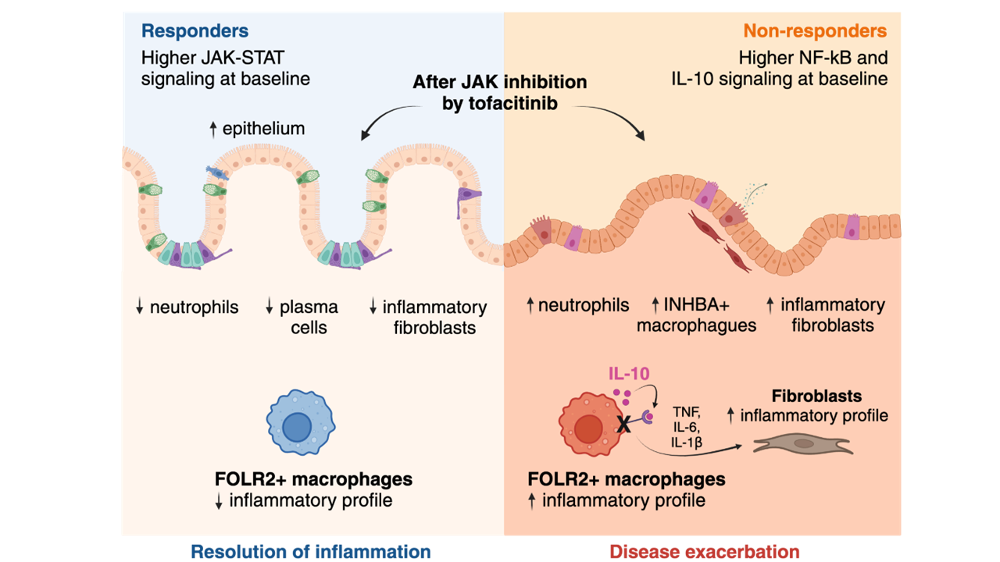

# Understanding the mechanisms underlying the lack of response to Janus kinase inhibition in ulcerative colitis

### Elisa Melón-Ardanaz, Marisol Veny, Ana M. Corraliza, Alba Garrido-Trigo, Victoria Gudiño, Ángela Sanzo-Machuca, Marc Buendia, Miriam Esteller, Maite Rodrigo, M. Carme Masamunt, Ángel Giner, Ingrid Ordás, Agnès Fernández-Clotet, Berta Caballol, Ángel Corbí, Bram Verstock, Severine Vermeire, Julian Panés, Elena Ricart, Azucena Salas

__Background and Aims:__ Tofacitinib, a Janus kinase inhibitor, is approved for the treatment of moderate-to-severe ulcerative colitis. Nonetheless, 40-60% of patients will not respond adequately. The mechanisms underlying responses to tofacitinib remain unknown.

__Methods:__ We applied __single-cell__ and/or __bulk RNA__ analysis to biopsies (n=23 and 63, respectively) from ulcerative colitis patients (n= 31) before and after tofacitinib treatment. Response was assessed using endoscopic and clinical criteria. In vitro-derived macrophages and primary intestinal fibroblasts were used to validate our findings.

__Results:__ Forty percent of patients responded to tofacitinib. Responders exhibited higher baseline JAK-STAT activity, while non-responders had increased baseline NF-kB pathway activation. Response was associated with significant changes in the abundance and/or activation of immune, epithelial, and stromal cells and the downregulation of _S100A9_, _FCGR3A_, _MMP12_ in resident macrophages. In contrast, non-responders showed a significant increase in the number and activation of macrophages and fibroblasts following tofacitinib treatment, including upregulation of _MMP9_, _IL1B_, _IL6_, _CXCL1_, _CXCL8_ and _S100A9_ compared to baseline. In monocyte-derived macrophages tofacitinib drove the hyperactivation of macrophages in response to lipopolysaccharide, but not TNF or IFNγ. This effect is dependent on the inhibition of IL-10 signaling, which is abundantly induced in response to LPS, but not to TNF or IFNγ. In contrast, cultured fibroblasts, which produced no IL-10 regardless of thestimuli, showed no hyperactivation when pre-treated with tofacitinib.

__Conclusions:__ We conclude that resistance to tofacitinib is mediated by the hyperactivation of myeloid cells and we identify IL-10-dependent macrophages as one cellular subset contributing to this resistance.

## Distribution of this repository

This repository is composed with two main directories.

- Figures: In this directory you can find the code to develop each figure of the study. 
- Analysis: In this directory you can find all the code to perform the same analysis of the study.

> [!NOTE]  
If you apply this code, don't forget to mention us! 

